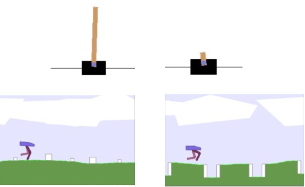

# RLlab
lab for reinforcement learning projects

## FRL

### Problem Statement

FL aims to train a global model without sharing the data from the local devices. The major challenges in FL are the training data in the local database are usually non-IID, and the communcations between server and clients are limited to the bandwidth and network environment. 

Although FL has been widely studied in supervised learning tasks, there are still little exploration on how to exploit the FL ideas to deal with the control or decision-making task in dynamic environments. In this work we consider leveraging the advantage of FL to train an robust and general agent that can perform in different environments while protecting the privacy.

### Motivation

Our target is to train the agent locally, with the help of the server, we hope the agent could perform well in similar environments but with different dynamics. The straightforward way to achieve this goal is to collect all the data to train the agent centrally, but to protect the privacy of the agents, we intuitively combine the FL methods with the off-policy RL algorithm TD3. And to better address the aforementioned objective heterogeneity problem, lots of work proposed different kind of local regularizer to constraint the training of the local model. However, these kinds of methods may not be works well in the reinforcement learning setting. As long as the value network trained on the local data, its estimation of different environments would be unreliable and such that leading to a bad performance of the actor network. Besides, naively aggregating the models would be very hard for the RL based algorithm to converge in the early stage of training, resulting in a high communication cost issue. Inspired by the work in \cite{luo2021no} and \cite{lin2020ensemble}, we introduce partial network distillation techniques to aggregate the local models while protecting the data collected by the local agents. And we compare our method with the baseline methods in FL.


### Objective Function

The global objective function is as follow:


$$
\min {F(w)} = \sum_{k=1}^Np_kF_k(w)
$$
In the Q learning setting, our goal is to find the optimal estimation function `Q_*(s,a)` ,   where
$$
Q_*(s,a) = \mathbb{E}_{S_{t+1}\sim p(.|S_t,a_t)}[R_t + \gamma max_a Q_*(S_{t+1},a)|S_t=s_t,A_t=a_t]
$$
we use TD to estimate the expectation,  we hope that we could find $w_*$   such that
$$
\mathbb{E}_{(s_t,s_{t+1})\sim D}[(Q_*(s_t,a_t) - (R_t + \gamma max_a Q_*(s_{t+1},a)))^2] = 0
$$
so the objective function can be:
$$
F(w) = \mathbb{E}_{S\sim D}[(Q_w(s_t,a_t) - (R_t + \gamma max_a Q_w(s_{t+1},a)))^2]
$$
rewrite it:
$$
F(w) = 1/N\sum_j^Nl(w;x_j) \\
l(\omega, x_j) = [Q_\omega(s_t^j,a_t^j) - (r_t^j + \gamma max_a Q_\omega(s_{t+1}^j,a))]^2 \\
x_j : (s_t^j,a_t^j,r_t^j,s_{t+1}^j) \sim D
$$
above is the centralize objective function, i.e. we only have the global agent, and the data $x_j$ is collected from the joint distribution `D`:
$$
P(x) = P(s_t,a_t,r_t,s_{t+1}) = P(s_t)P_w(a_t|s_t)P(s_{t+1}|s_t,a_t)
$$
therefore the data collected from exploration is affected by two distrbution $P(s)$ and $P_w(a|s)$, specifically it is affected by the environment and the current policy of the agent.

with above,  we denote the local objective function of the device `k`as:
$$
F_k(w_k) = 1/n_k\sum_j^{n_k}l(w_k;x_j^k) \\
x_j^k : (s_t^j,a_t^j,r_t^j,s_{t+1}^j) \sim D_k
$$
In this case, if  the environment of device k is different or the policy of the agent k isdifferent, the distribution $D_k$ would be different, and the collected data would be non iid.

The update of the parameters $w_k$:
$$
w_{t+i+1}^k = w_{t+i}^k - \eta\nabla F_k(w_{t+i}^k;x_{t+i}^k), i = 0,1,..,E \\
\nabla F_k(w_{t+i}^k;x_{t+i}^k) = 1/n_k\sum_j^{n_k}\nabla l(w_t^k;x_j^k)
$$
$w_t$ is the parameters loaded from server at time step $t$ .  $E$ is the update frequency.  The update of `FedAvg` in global:
$$
w_{t+E} = \sum_{k =1}^N p_kw_{t+E}^k
$$
$p_k=n_k/n$ , We  assume $n_0 = n_1... = n_k$  and the environment is stationary i.e. $P(s)$  of different device is identity, to prove that when E=1, above update is equivalent to centralized mode update:
$$
w_{t+1} = \sum_{k =1}^N p_kw_{t+1}^k\\
= \sum_{k =1}^N p_k[w_t^k - \eta\nabla F_k(w_t^k;x_t^k)]\\
=\sum_{k=1}^N \frac{n_k}{n}w_t^k - \eta\sum_{k=1}^N \frac{n_k}{n}\frac{1}{n_k}\sum_{j=1}^{n_k}\nabla l(w_t^k;x_{tj}^k) \\
$$
when $n_0 = n_1... = n_k$ and $w_t^k = w_t$:
$$
\sum_{k=1}^N \frac{n_k}{n}w_t^k - \eta\sum_{k=1}^N \frac{n_k}{n}\frac{1}{n_k}\sum_{j=1}^{n_k}\nabla l(w_t^k;x_{tj}^k) \\
=w_t - \eta F(w_t; x_t)
$$
where $x_t=\left\{x_t^k\right\}k\in N$ .

consider that in distributed dqn, there are two ways to collect the data, one is Gorila dqn, randomly choose data from local replay buffer which contains the data collected based on old policy, so the data is from vary distribution. The other is asynchrounous one step dqn, compute the gradient based on current policy. In fedavg, when E = 1, and if the environment is identity, the collected data would be from the identity distribution, but however when E > 1, each local data collected from the device are based on different local policy, so the local data within the device would be very relavant, but data between the device would be very different, this could be affect the averaging. So I think we sill need the replay buffer to randomly collect data.

### Pseudo code for FedTD3

```python
syncronise local update:
sync Q μ from server
set n = 0;
for t in T:
	agent explore based on μ
	agent saves collected data to local data base
	agent update Q based on target network
	if t mod N == 0:
		agent send Q, wait for server aggregate
		agent receive Qt from server.
	if t mod M == 0:
        n += 1
		agent update μ based on local Q
        if n mod L == 0:
			agent send μ to server, wait for server aggregate.
			agent receive μ from server
		agent update policy target based on current policy net
        agent update Q target based on current Q net
```

### Project Structure

```shell
├─main
│  └─dist_reg.py
│  └─dist_reg_v2.py
│  └─dist_td3.py
│  └─fedregtd3.py
│  └─fedtd3_reg.py
│  └─fed_scaffold.py
│  └─scaffold_td3.py
│  └─central_classic.py
│  └─central_box2d.py
├─models
│  └─Network.py
├─non_stationary_envs
│  └─ContinuousCart.py
│  └─Pendulum.py
│  └─walker.py
├─utils
│  └─Memory.py
│  └─Tools.py
```

The key programs are contained in the `main` folder. The file start with `dist*` are our method and the others are baseline methods. The file start with `central*` are the methods that collect all the local data and do the training in the server side. Basically it violate the federated setting but it provides information that how far the federated algorithm can achieve.

The codes have the following basic components: 

```python
def ClientUpdate(client_pipe, agent, local_env, args):
```

This function implement the training of the local agents. It would be run in a multiprocess way. Every round of communication it would send the parameters of the critic or actor to the main process.

```python
def ServerUpdate(pipe_dict, server, weighted, actor, envs, args): 
```

This function is for the update of the server. It collects all the models from the local side and do the model fusion. The model fusion function is as follow:

```python
def Agg_q(local_models, global_net, weighted, args):
    """
    :param local_models:  tuple local q_net output layer
    :param global_net:   tuple too
    :param weighted: 
    :param args: 
    :return: 
    """
    with torch.no_grad():
        K = args.client_num
        for i in range(2):
            for params in global_net[i].keys():
                global_net[i][params].copy_(weighted[0] * local_models[0][i][params])
            for params in global_net[i].keys():
                for k in range(1, K):
                    global_net[i][params] += weighted[k] * local_models[k][i][params]
```

In the baseline method, the local models are naively weighted aggregated. In our method, we would do the model distillation after aggregating the  models. The following function is the `distillation` part.

```python
def distill(self, args):
        for epoch in range(args.epochs):
            for data in self.train_loader:
                rep1, rep2, label1, label2 = data
                rep1, rep2, label1, label2 = rep1.to(args.device), rep2.to(args.device), label1.to(args.device), label2.to(args.device)

                oupt1, oupt2 = self.q.server_oupt(rep1, rep2)
                # oupt = torch.cat(oupt)

                self.optimizer.zero_grad()
                loss = self.loss_fn(oupt1, label1) + self.loss_fn(oupt2, label2)
                loss.backward()
                self.optimizer.step()
```


### Dataset

As mentioned above,  we generate different local environment with different transition function $p(s_{t+1}|s_t)$.  To achieve this goal,  we randomly change the physical environment parameters in the source code of gym. For example, in the environment `cartpole`, we change the pole length, pole mass and cart mass also the gravity. In the environment `BipedalWalkerHardcore`,   there are three kinds of obstacle. We change the occurence probability of each obstacle to induce the environment heterogeneity. 



Another method to simulate heterogeneous environments is to add noise to the input of the agents. In each local environment we add Gaussian noise with different mean to the agent's input. i.e.:
$$
<s,a> + N(\mu_i, \sigma)
$$


